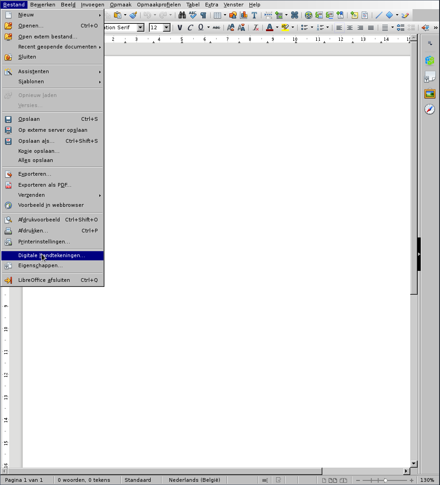
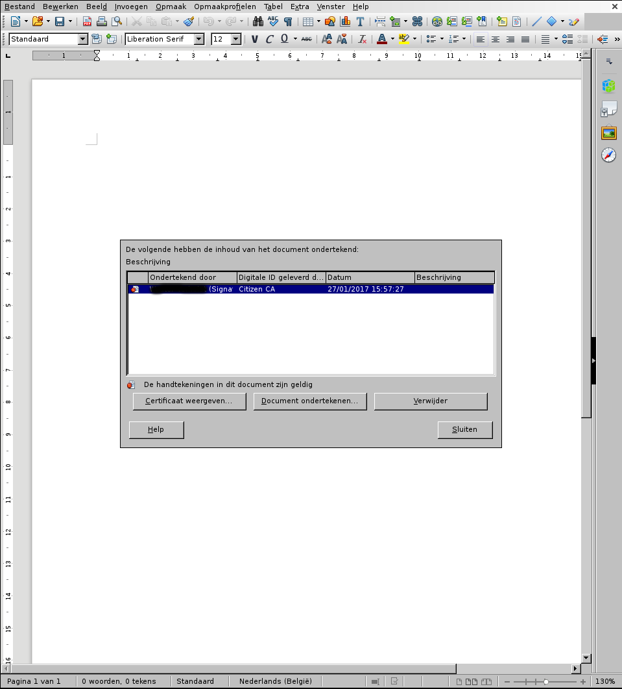
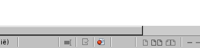

# Debian/Ubuntu/Linux Mint: na installatie van het eid-archive pakket kan de middleware en/of de viewer niet gevonden worden.

Op deze distributies moet u eerst de index cache updaten vooraleer de
gevraagde pakketten gevonden kunnen worden:

    sudo apt-get update

Indien u gebruikt wenst te maken van het Ubuntu Software Center, dan
komt daaar nog bij:

    sudo update-software-center

# Ik vind een "candidate" en/of een "continuous" repository in mijn repository-configuratie. Moet ik die inschakelen?

Neen. Deze repositories bevatten beta-versies van de eID software. U mag
deze inschakelen indien u dat wenst, maar voor normaal gebruik raden wij
dat niet aan.

# Hoe moet ik de 32-bit versies van de middleware op mijn 64-bit systeem installeren?

Eerst en vooral moet u er voor zorgen dat u de 64-bit versie van de
middleware geïnstalleerd hebt. Op een 64-bit systeem kan de middleware
niet werken.

Indien u met Debian, Ubuntu, of Linux Mint werkt, moet u daarna
"multi-arch" inschakelen, indien dat nog niet gebeurd is:

    sudo dpkg --add-architecture i386
    sudo apt-get update

Vervolgens installeert u het pakket met daarin de 32-bit versies van de
bibliotheekcomponenten van de middleware. De naam van dit pakket is, om
technische redenen, afhankelijk van de distributie die u gebruikt:

- Debian, Ubuntu, Linux mint: `libbeidpkcs11-0:i386`
- Fedora, Red Hat Enterprise Linux, CentOS: `eid-mw-libs.i686`
- OpenSUSE: `eid-mw-libs-32bit`

De middleware zou nu beschikbaar moeten zijn in zowel de 32-bit als de
64-bit versie. U kan dit controleren door de applicatie `about-eid-mw`
uit te voeren; onder het kopje "32-bit PKCS#11 locatie" staat de
bestandsnaam van de middleware module, dewelke u in uw 32-bit applicatie
kan opgeven.

Merk op dat er geen 32-bit versie van Red Hat (of CentOS) 7 beschikbaar
is. Om die reden is het op die distributies ook niet mogelijk om de
32-bit versie van de middleware te installeren.

# Hoe configureer ik Google Chrome/Chromium onder Linux om me aan te melden met de eID?

Google Chrome onder Linux gebruikt NSS voor certificaatbeheer. Er is
geen gebruikersinterface beschikbaar om PKCS#11-modules te installeren;
met de NSS-tools kan u het echter wel laten werken.

Deze tools vindt u in de volgende pakketten:

- Debian, Ubuntu, Linux Mint: `libnss3-tools`
- Fedora: `nss-tools`
- OpenSUSE: TODO

Vervolgens kan u de database met PKCS#11-modules bewerken. Sluit Chrome,
en voer de volgende commando's uit:

    cd
    modutil -dbdir sql:.pki/nssdb -add "Belgium eID -libfile /usr/lib/libbeidpkcs11.so

Merk op dat het pad naar `libbeidpkcs11.so` afhankelijk is van de
distributie. U kan het juiste pad vinden door de `about-eid-mw` tool te
starten. Wanneer u de lijn met het pad voor de bibliotheek selecteert,
kan u op de "kopiëren" knop klikken om het pad te kopiëren.

Na uitvoeren van het bovenstaande kan u controleren of alles goed gelukt
is:

    modutil -dbdir sql:.pki/nssdbi/ -list

Als alles goed gegaan is, zou u iets als onderstaande moeten zien:

    Listing of PKCS #11 Modules
    -----------------------------------------------------------
      1. NSS Internal PKCS #11 Module
             slots: 2 slots attached
            status: loaded
    
             slot: NSS Internal Cryptographic Services
            token: NSS Generic Crypto Services
    
             slot: NSS User Private Key and Certificate Services
            token: NSS Certificate DB
    
      2. Root Certs
            library name: /home/koen/.pki/nssdb/libnssckbi.so
             slots: 1 slot attached
            status: loaded
    
             slot: NSS Builtin Objects
            token: Builtin Object Token
    
      3. Belgium eID
            library name: /usr/lib/libbeidpkcs11.so
             slots: 1 slot attached
            status: loaded
    
             slot: SCM SCR 3310 [CCID Interface] (21120503109149) 00 00
            token: BELPIC
    -----------------------------------------------------------

U kan nu uw eID gebruiken in Google Chrome en Chromium.

# Hoe kan ik een document ondertekenen onder LibreOffice?

LibreOffice maakt gebruik van de NSS-bibliotheek van Firefox voor beheer
van certificaten. Dit betekent dat u eerst en vooral Firefox moet
configureren. Om dat te doen, moet u de middleware installeren, en moet
u daarna Firefox minstens één keer gestart of herstart hebben. Daarna
kiest u de volgende opties:

- Bestand - Digitale Handtekeningen...

    

    - Indien het bestand nog niet opgeslagen is, vraag LibreOffice om
      dat nu te doen. U kan alleen opgeslagen documenten ondertekenen.
- U ziet nu het dialoogvenster met reeds bestaande handtekeningen op dit
  document. Indien er nog geen zijn, is het dialoogvenster leeg.
- Steek uw kaart in de lezer, en klik vervolgens op "Document
  ondertekenen..."
- Kies uw handtekening ("Signature") certificaat in de lijst. De lijst
  zal ook uw authenticatie-certificaat bevatten; hiermee kan u echter
  *geen* rechtsgeldige handtekening zetten!

    

- Klik op "OK". Het systeem vraagt nu naar uw PIN-code; geef ze in.

    

- Uw handtekening wordt nu aan de lijst met handtekeningen toegevoegd.
  Indien een andere gebruiker zijn of haar handtekening wilt toevoegen,
  kan u de procedure herhalen voor die gebruiker.

    

Wanneer u een ondertekend document opent in LibreOffice, ziet u onderaan
het venster ook een icoontje om aan te geven dat het document
ondertekend is:

